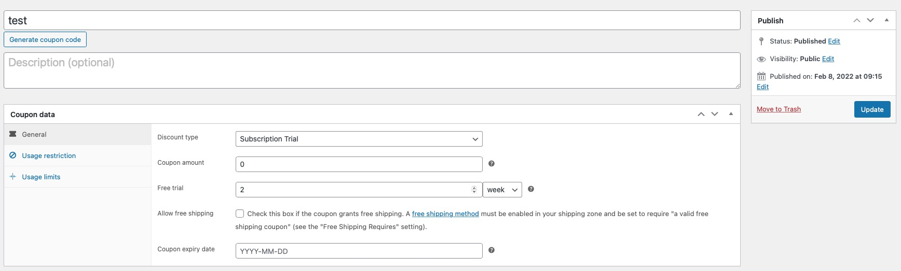
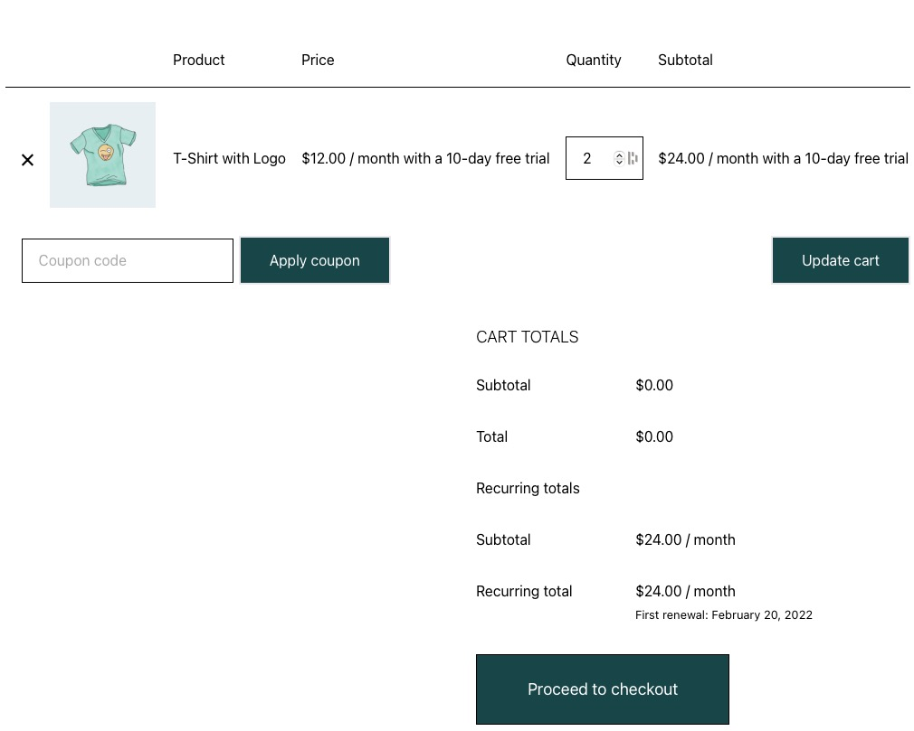
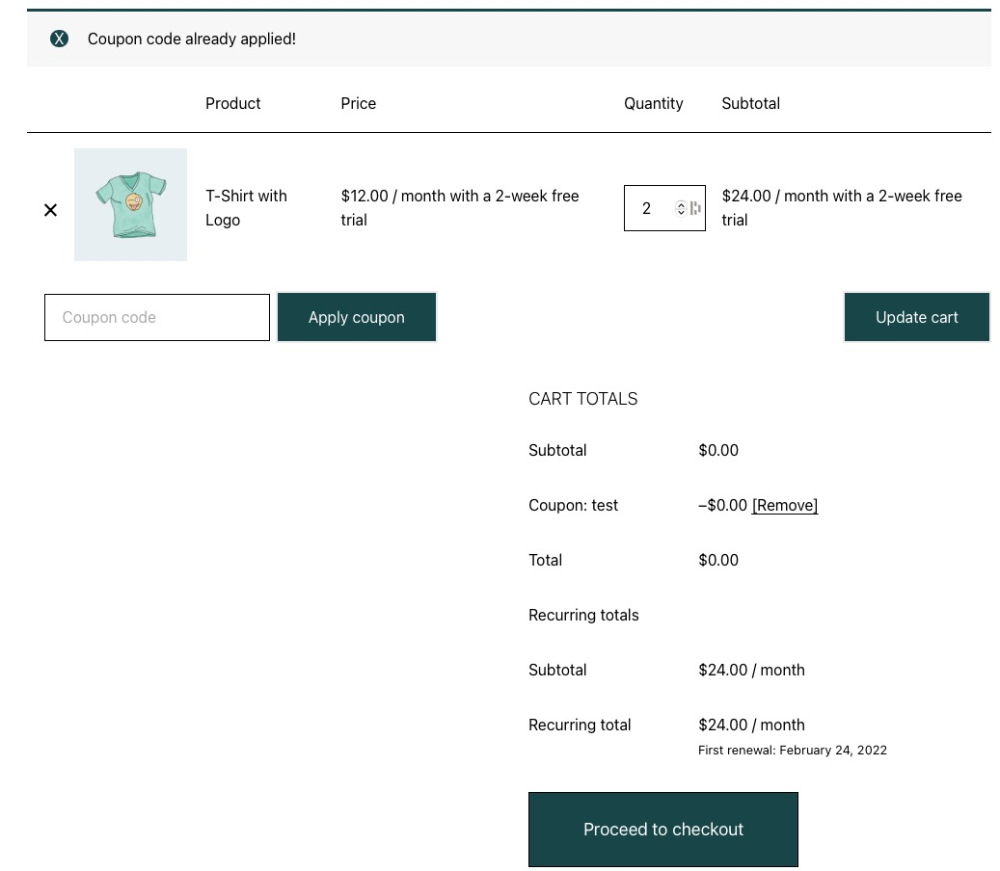

<div align="center">


# Extended Trial Coupon for WC Subscription

**Extend the free trial period of WooCommerce Subscription products with a dedicated coupon type.**

[](https://wordpress.org/plugins/extended-trial-coupon-for-wc-subscription/)
[](https://wordpress.org/plugins/extended-trial-coupon-for-wc-subscription/advanced/)
[](https://wordpress.org/plugins/extended-trial-coupon-for-wc-subscription/#reviews)
[](https://wordpress.org/plugins/extended-trial-coupon-for-wc-subscription/)
[](https://www.gnu.org/licenses/old-licenses/gpl-2.0.en.html)
[](https://www.php.net/supported-versions.php)

[**Download from WordPress.org**](https://wordpress.org/plugins/extended-trial-coupon-for-wc-subscription/) &nbsp;·&nbsp; [**Changelog**](#changelog) &nbsp;·&nbsp; [**Releasing**](#development--releasing)

</div>

---

Perfect for promotions, launch campaigns, and extended evaluation access — offer a longer free trial on any subscription product **without touching the product's own trial settings**, just by applying a coupon at checkout.

## ✨ Features

- Adds a new coupon type to WooCommerce: **Subscription Trial**
- Overrides the trial length of any subscription product in the cart
- Works with every discount type combination:
  - Sign Up Fee Discount
  - Sign Up Fee % Discount
  - Recurring Product Discount
  - Recurring Product % Discount
- Compatible with **Cart & Checkout blocks**
- Fully compatible with **WooCommerce HPOS** (High-Performance Order Storage)
- Trial length is applied via WooCommerce Subscriptions filters — no product meta is mutated
- Translation-ready (SE · ES · DE · NL · FR included)

## 📋 Requirements

| Component                  | Minimum | Tested up to |
| -------------------------- | ------- | ------------ |
| WordPress                  | 5.7     | 7.1          |
| PHP                        | 8.0     | 8.5          |
| WooCommerce                | 8.0     | 11.0.1       |
| WooCommerce Subscriptions  | latest  | latest       |

WooCommerce **and** WooCommerce Subscriptions must both be active — the plugin registers its coupon type through their APIs.

## 📦 Installation

1. Go to **Plugins → Add New** in your WordPress admin
2. Search for **Extended Trial Coupon for WC Subscription**
3. Click **Install Now**, then **Activate**
4. Go to **WooCommerce → Coupons → Add coupon** and pick the **Subscription Trial** discount type
5. Under *Coupon data → General*, set the **Free trial** length and period the coupon should grant

Manual installation: upload the `extended-trial-coupon-for-wc-subscription` folder to `/wp-content/plugins/` and activate it.

## 🖼 Screenshots

**1. Create a coupon with the *Subscription Trial* discount type and set the extended trial length**



**2. Cart before the coupon — the product shows its original 10-day free trial**



**3. Cart after applying the coupon — the free trial is extended to 2 weeks**



## ❓ FAQ

**Does it work without WooCommerce?**
No. WooCommerce (and WooCommerce Subscriptions) are required.

**Is it compatible with existing WooCommerce Subscriptions coupon types?**
Yes — it integrates with all default subscription-related coupon types.

**Is it HPOS compatible?**
Yes. Compatibility is declared with WooCommerce, and trial overrides never read or write order data through legacy post meta.

**Does it work with Cart & Checkout blocks?**
Yes. Trial overrides use WooCommerce Subscriptions product filters, so they apply in both classic and block-based cart/checkout.

## 🔄 Changelog

All notable changes are documented in [readme.txt](readme.txt).

### 1.7.1
- Changed: Text domain now matches the WordPress.org plugin slug
- Fixed: Bundled translation files renamed and recompiled so translations load correctly
- Changed: Composer metadata cleanup and release automation — no functional changes

### 1.7
- Tested with WordPress 7.1, WooCommerce 11.0.1, and PHP 8.5
- Security: Review notice actions require a nonce and capability check; coupon trial fields are sanitized on save
- Fixed: Trial coupons rejected as an unknown coupon type; only the first applied coupon was checked for trial data
- Changed: Trial length applied via subscription filters instead of mutating product meta (HPOS-safe)
- Added: Cart & Checkout blocks compatibility declaration

## 🔒 Privacy

This plugin uses the [Appsero](https://appsero.com) SDK to collect optional telemetry data **only after the user explicitly opts in** via the admin notice. No data is gathered by default or without consent. See [Appsero's privacy policy](https://appsero.com/privacy-policy/).

## 🛠 Development & Releasing

```bash
composer install          # full install incl. dev PHP stubs (never committed)
composer validate
```

- Runtime dependencies (`appsero/client`) are committed under `vendor/`; development-only packages (`php-stubs/*`) are not.
- The production build is assembled by CI: `composer install --no-dev`, PHP lint, then deployment.

**Release a new version**

1. Update the version in `wcs-trial-coupon.php` (header + `WCS_Trial_Coupon::version`) and `readme.txt` (`Stable tag` + changelog)
2. Merge to `main`
3. Tag the release (`git tag 1.7.2 && git push origin 1.7.2`) — the **Deploy to WordPress.org** workflow builds the plugin and commits it to the WordPress.org SVN trunk and tag directory
4. To test first: run the workflow manually via **Actions → Deploy to WordPress.org → Run workflow** with *Dry run* enabled — it performs the full build and produces the exact ZIP that would ship, without committing anything to SVN

**Readme / asset changes** (banner, icons, screenshots under `.wordpress-org/`) are synced to WordPress.org automatically on every push to `main` that touches `readme.txt` or `.wordpress-org/**`.

Secrets required by CI (Settings → Secrets and variables → Actions): `SVN_USERNAME` and `SVN_PASSWORD` — your [WordPress.org SVN credentials](https://plugins.svn.wordpress.org/).

## ⚖ License

GPL-2.0-only — see [LICENSE](https://www.gnu.org/licenses/old-licenses/gpl-2.0.en.html).

Maintained and improved by [Betatech](https://betatech.co/) as a successor to the original *Free Trial Coupon for WooCommerce Subscriptions* plugin.
